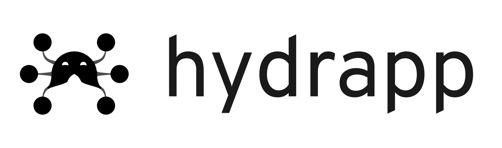
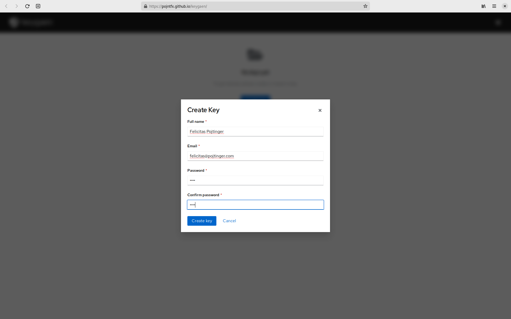
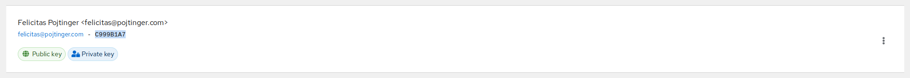
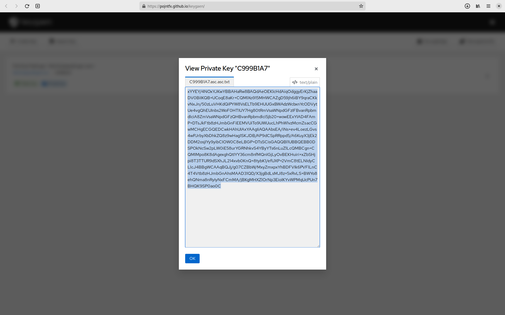
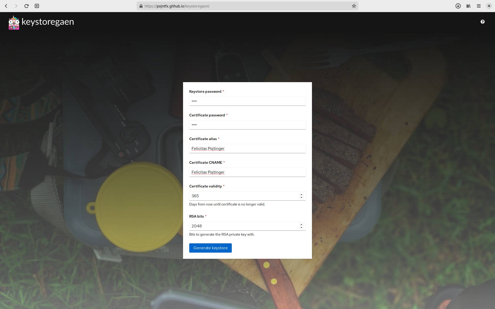
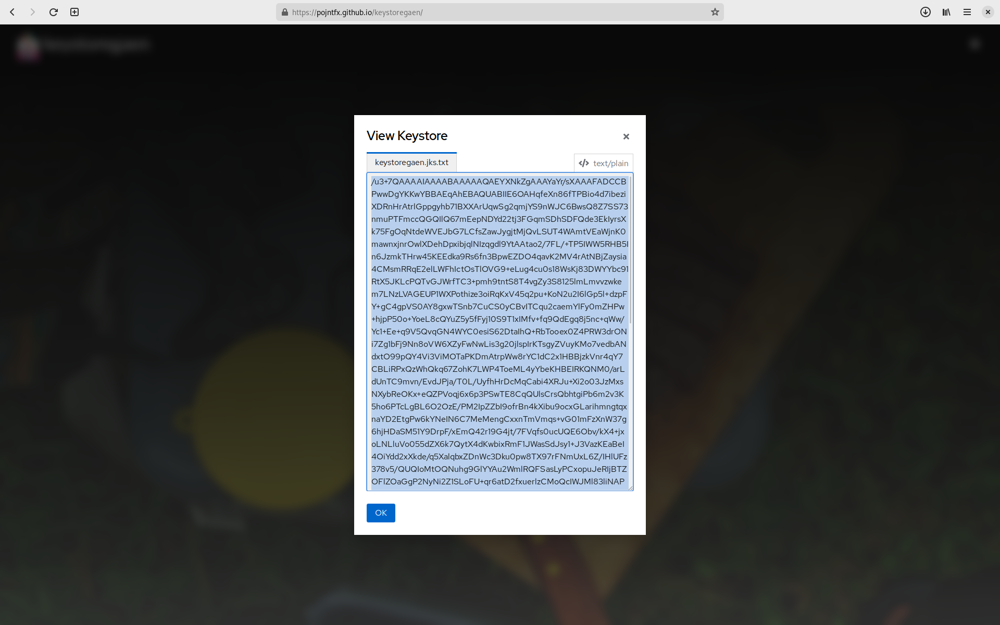
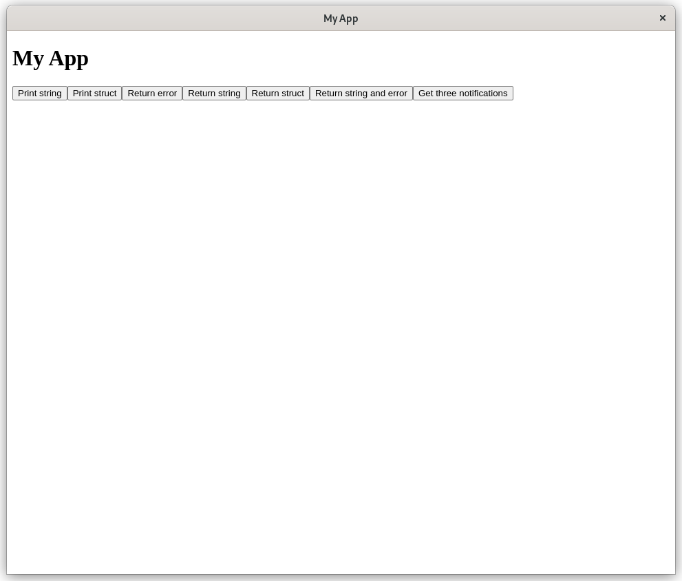
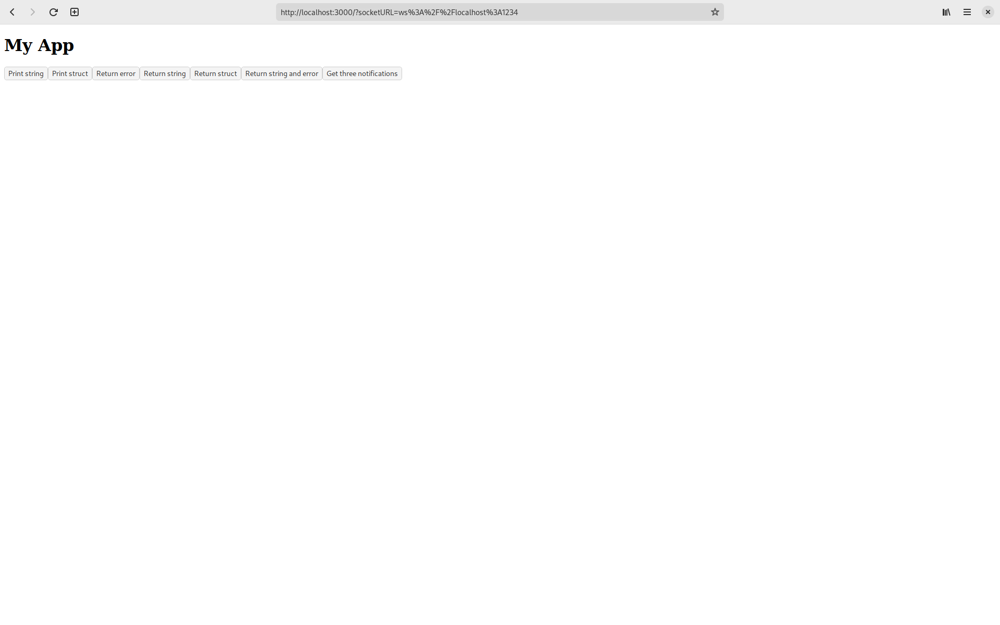
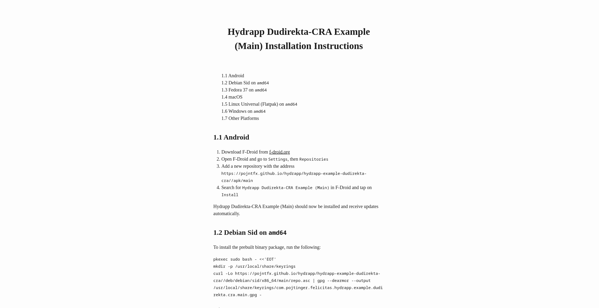

# hydrapp



Build fast apps that run everywhere with Go and a browser engine of your choice.

[](https://github.com/pojntfx/hydrapp/actions/workflows/hydrapp.yaml)

[](https://pkg.go.dev/github.com/pojntfx/hydrapp/hydrapp)
[](https://matrix.to/#/#hydrapp:matrix.org?via=matrix.org)

## Overview

hydrapp is a small Go framework similar to Electron with unique feature: It **can use (almost) any browser engine** to render the frontend!

It enables you too ...

- **Build apps in Go and JS:** Use the speedy and easy-to-learn Go language to create your app's backend, then use your web tech know-how to develop a top-notch, user-friendly frontend.
- **Connect frontend and backend with ease:** With hydrapp and [panrpc](https://github.com/pojntfx/panrpc), you can easily call functions between the frontend and backend without any complicated manual setup.
- **Compatible with all browsers:** Hydrapp works with any pre-installed browser by starting it in PWA mode, so you can render your app on Chrome, Firefox/Gecko, Epiphany/Webkit, and even Android WebView.
- **Cross-compile easily with full CGo support:** Hydrapp simplifies cross-compilation with a container-based environment that includes MacPorts, MSYS2 on WINE, APT, and DNF, making it easy to distribute binaries without using non-Linux machines.
- **Effortlessly build, sign, distribute, and update your app:** Hydrapp streamlines your app's delivery with an integrated CI/CD workflow, producing reproducible packages for DEB, RPM, Flatpak, MSI, EXE, DMG, APK, and static binaries for all other platforms. Hydrapp can also generate APT, YUM, and Flatpak repositories for Linux and F-Droid repositories for Android. Self-updating for Windows, macOS, and other platforms is also available.

## Installation

hydrapp comes with a CLI to help with building and generating projects. While not required, it makes getting started a lot easier.

Its static binaries are available on [GitHub releases](https://github.com/pojntfx/hydrapp/releases).

On Linux, you can install them like so:

```shell
$ curl -L -o /tmp/hydrapp "https://github.com/pojntfx/hydrapp/releases/latest/download/hydrapp.linux-$(uname -m)"
$ sudo install /tmp/hydrapp /usr/local/bin
```

On macOS, you can use the following:

```shell
$ curl -L -o /tmp/hydrapp "https://github.com/pojntfx/hydrapp/releases/latest/download/hydrapp.darwin-$(uname -m)"
$ sudo install /tmp/hydrapp /usr/local/bin
```

On Windows, the following should work (using PowerShell as administrator):

```shell
PS> Invoke-WebRequest https://github.com/pojntfx/hydrapp/releases/latest/download/hydrapp.windows-x86_64.exe -OutFile \Windows\System32\hydrapp.exe
```

You can find binaries for more operating systems and architectures on [GitHub releases](https://github.com/pojntfx/hydrapp/releases).

## Usage

### 1. (Optional) Setting Up a Repo

While not necessary for local development, setting up a repository is a good first step to be able to distribute your app's builds as quickly as possible. On GitHub, head over to [github.com/new](https://github.com/new) to do so. Please take of the `owner` and `repository name` you've chosen; in these docs, we'll use `example` and `myapp`.

### 2. (Optional) Generating and Uploading Your Secrets

While also not strictly necessary, in order to be able to distribute your applications safely, you'll need to generate and upload two secrets - a PGP key and a Java keystore.

**Generating the PGP key**:

First, generate a PGP key. You can do this using the `gpg` CLI, but an easier way is to use [keygaen](https://pojntfx.github.io/keygaen/), which allows you to do it in directly in your browser:

[](https://pojntfx.github.io/keygaen/)

Create a key with your name and email, and take note of the password you've chosen:



The first GitHub Actions secret you need to save is `PGP_PASSWORD`; simply use the password you've created above as the value (base64-encoded).

Now that you've generated your key, you can add it to your repository's secrets; let's start with the PGP key ID. To find it, copy the string next to your key's email:



Save this in a new GitHub Actions secret `PGP_ID` in the repository you've set up earlier.

Next, let's add the PGP _private_ key's contents to the repo. To do so, export the key with armor and base64-encoding enabled, copy it's content and add it to a secret named `PGP_KEY`:



Also be sure to download the key (armored & base64-encoded) so you can use it for local builds.

**Generating the Java keystore**:

You'll also need to generate a keystore. You can do this using the `keytool` CLI, but an easier way again is to use [keystoregaen](https://pojntfx.github.io/keystoregaen/), a tool similar to keygaen, but for Java keystores:

[](https://pojntfx.github.io/keystoregaen/)

Create a key with your name, and take note of the password you've chosen:



The first two GitHub Actions secrets you need to save are `APK_STOREPASS` and `APK_KEYPASS`; set them to the passwords you've chosen above respectively (base64-encoded).

Next, let's add the keystore's contents to the repo. To do so, export it with base64-encoding enabled, copy it's content and add it to a secret named `APK_CERT`:



Also be sure to download the keystore (base64-encoded) so you can use it for local builds.

### 3. Generating Your Project

To get started easily, hydrapp provides the interactive `hydrapp` CLI. To use it to generate a project for you, simply run `hydrapp new` with the values that match your usecase.

First, select your preferred starter project:

```plaintext
? Which project type do you want to generate?:
    rest: Simple starter project with a REST API to connect the frontend and backend
    forms: Traditional starter project with Web 1.0-style forms to connect the frontend and backend
    panrpc-parcel: Complete starter project with bi-directional panrpc RPCs to connect the frontend and backend (based on the Parcel bundler)
```

Next, set your app ID; this can be anything that's a valid reverse FQDN, e.g. the GitHub repo you're using:

```plaintext
App ID in reverse domain notation: com.github.example.myapp
```

The app name, summary, description, homepage and git repo are self-explanatory:

```plaintext
App name: My App
App summary: My first app
App description: My first application, built with hydrapp.
App homepage: https://github.com/example/myapp
App git repo: https://github.com/example/myapp.git
```

The base URL should be the URL that you're planning to host the generated repos on; for GitHub pages without a custom domain, this should follow the scheme `https://<username|orgname>.github.io/<reponame>/`:

```plaintext
App base URL to expect the built assets to be published to: https://example.github.io/myapp/
```

The Go module name should be your vanity URL or GitHub repo to use:

```plaintext
Go module name: github.com/example/myapp
```

You can set a license by choosing a SPDX identifier; note that this **has** to be a valid [SPDX identifier](https://spdx.org/licenses/) as it downloads the license text:

```plaintext
License SPDX identifier (see https://spdx.org/licenses/): Apache-2.0
```

The release author name, author email and directory are self-explanatory:

```plaintext
Release author name: Jean Doe
Release author email: jean.doe@example.com
Directory to write the app to: .
```

Finally, you can choose to do advanced configuration; in this basic introduction, we won't be doing that:

```plaintext
? Do you want to do any advanced configuration?:
  ▸ no
    yes
```

After pressing <kbd>Enter</kbd>, the project will be generated, dependencies will be installed and the instructions for continuing will be displayed:

```shell
2023/02/28 17:25:58 Success!
Succesfully generated application. To start it, run the following:

cd myapp
go run .

You can find more information in the generated README.
```

### 4. Starting the Project

You can start the project in its own PWA-mode browser instance and with the pre-compiled frontend like so:

```shell
$ cd myapp
$ go run .
```

The basic example should look like this:



When you are developing locally however, you can also start the frontend manually with hot-reloading and in your preferred browser by exporting a few environment variables:

```shell
# In the first terminal
$ export HYDRAPP_BACKEND_LADDR="localhost:1234" HYDRAPP_TYPE="dummy"
$ go run .
2023/02/28 17:35:02 Backend URL: ws://localhost:1234
2023/02/28 17:35:02 Frontend URL: http://localhost:38031?socketURL=ws%3A%2F%2Flocalhost%3A1234

# In the second terminal
$ cd pkg/frontend
$ npm run dev
```

And open the URL (note the `socketURL` parameter): [http://localhost:3000?socketURL=ws%3A%2F%2Flocalhost%3A1234](http://localhost:3000?socketURL=ws%3A%2F%2Flocalhost%3A1234):



Whenever you make changes to the frontend's source code, it should be automatically reloaded.

### 5. Build The Packages Locally

While it also possible to build your hydrapp app using the `go build` command you already know, it is recommended to use the `hydrapp build` command instead as its able to not only create binaries, but also proper OS-specific packages.

To use it, first export the path to and credentials for the PGP key you've downloaded above:

```shell
$ export PGP_KEY="${HOME}/Downloads/19D789F4.asc.txt" PGP_PASSWORD="$(echo asdf | base64)" PGP_ID='19D789F4'
```

Next, do the same for the Java keystore:

```shell
$ export APK_CERT="${HOME}/Downloads/keystoregaen.jks.txt" APK_STOREPASS="$(echo asdf | base64)" APK_KEYPASS="$(echo asdf | base64)"
```

And finally, your branch. hydrapp supports building multiple branches of your app - such as a main branch for your canary builds, the stable branch (for tagged releases) and any further feature branches you might want to build for. In this case, we'll build for the `main` branch:

```shell
$ export BRANCH_ID="main" BRANCH_NAME="Main"
```

You're now ready to build your app:

```shell
$ hydrapp build \
    --config='./hydrapp.yaml' \
    --exclude='deb|dmg|flatpak|msi|rpm|apk|tests' \
    --pull=true \
    --tag='main' \
    --dst="${PWD}/out" \
    --src="${PWD}" \
    --pgp-key="${PGP_KEY}" \
    --pgp-password="${PGP_PASSWORD}" \
    --pgp-id="${PGP_ID}" \
    --apk-cert="${APK_CERT}" \
    --apk-storepass="${APK_STOREPASS}" \
    --apk-keypass="${APK_KEYPASS}" \
    --concurrency="$(nproc)" \
    --branch-id="${BRANCH_ID}" \
    --branch-name="${BRANCH_NAME}"
```

Note the `--exclude` flag; in this configuration, only `binaries` is missing, meaning that only binaries will be built; you can remove e.g. RPM and an RPM package would be built instead.

### 6. Releasing Your App

As previously mentioned, hydrapp supports branches. To release your software to the `main` branch, push it to your GitHub repository, and the GitHub action will build it for you. After the actions have completed successfully, [enable GitHub pages](https://docs.github.com/en/pages/getting-started-with-github-pages/configuring-a-publishing-source-for-your-github-pages-site) for the `gh_pages` branch.

You can now install and use this canary build of your app by following the instructions in the generated installation docs file linked in your README. When you're ready to tag a release, add a new entry to your `hydrapp.yaml` file under `releases` (ensure that you follow [semantic versioning](https://semver.org/)), run `git tag v<major>.<minor>.<patch>`, and `git push --tags`. The action should then automatically build a tagged release for you. Remember to update the installation instructions link to point to it by replacing `docs/main/INSTALLATION.html` with `docs/stable/INSTALLATION.html`:



Note that there are many more things you can configure in the framework. For example, if you want to introduce native dependencies, check out [connmapper](https://github.com/pojntfx/connmapper) - it's able to easily use `libpcap` thanks to hydrapp's integrated package management support. If you want to overwrite the build configs manually, you can always pass `--eject` to the build command, which will render the Debian `rules` file, the RPM `.spec`, the WIX installer files, the Flatpak manifest, the Android Manifest etc. in-place, giving you the ability to customize everything to your liking.

**🚀 You're all set to share your app with your users now!** We can't wait to see what you're going to build with hydrapp.

## Reference

### Examples

To make getting started with hydrapp easier, take a look at the following examples:

- [**REST**](./hydrapp-example-rest/): Simple starter project with a REST API to connect the frontend and backend
- [**Forms**](./hydrapp-example-forms/): Traditional starter project with Web 1.0-style forms to connect the frontend and backend
- [**panrpc & Parcel**](./hydrapp-example-panrpc-parcel/): Complete starter project with bi-directional panrpc RPCs to connect the frontend and backend (based on the Parcel bundler)

### Command Line Arguments

```shell
$ hydrapp --help
Build apps that run everywhere with Go and a browser engine of your choice (Chrome, Firefox, Epiphany or Android WebView).
Find more information at:
https://github.com/pojntfx/hydrapp

Usage:
  hydrapp [command]

Available Commands:
  build       Build a hydrapp project
  completion  Generate the autocompletion script for the specified shell
  help        Help about any command
  new         Generate a new hydrapp project

Flags:
  -h, --help   help for hydrapp

Use "hydrapp [command] --help" for more information about a command.
```

<details>
  <summary>Expand subcommand reference</summary>

#### New

```shell
$ hydrapp new --help
Generate a new hydrapp project

Usage:
  hydrapp new [flags]

Aliases:
  new, n

Flags:
  -h, --help         help for new
      --no-network   Disable all network interaction
```

#### Build

```shell
$ hydrapp build --help
Build a hydrapp project

Usage:
  hydrapp build [flags]

Aliases:
  build, b

Flags:
      --apk-cert string        Path to Android keystore
      --apk-keypass string      Password for Android certificate (if keystore uses PKCS12, this will be the same as --apk-storepass)
      --apk-storepass string   Password for Android keystore
      --branch-id string       Branch ID to build the app as, i.e. main (for an app ID like "myappid.main" and baseURL like "mybaseurl/main"
      --branch-name string     Branch name to build the app as, i.e. Main (for an app name like "myappname (Main)"
      --concurrency int        Maximum amount of concurrent builders to run at once (default 1)
      --config string          Config file to use (default "hydrapp.yaml")
      --dst string             Output directory (must be absolute path) (default "/home/pojntfx/Projects/hydrapp/out")
      --eject                  Write platform-specific config files (AndroidManifest.xml, .spec etc.) to directory specified by --src, then exit (--exclude still applies)
      --exclude string         Regex of platforms and architectures not to build for, i.e. (apk|dmg|msi/386|flatpak/amd64)
  -h, --help                   help for build
      --no-network             Disable all network interaction
      --overwrite              Overwrite platform-specific config files even if they exist
      --pgp-id string          ID of the PGP key to use
      --pgp-key string         Path to armored PGP private key
      --pgp-password string    Password for PGP key
      --pull                   Whether to pull the images or not
      --src string             Source directory (must be absolute path) (default "/home/pojntfx/Projects/hydrapp")
      --tag string             Image tag to use (default "latest")
```

</details>

### Environment Variables

All command line arguments described above can also be set using environment variables; for example, to set `--eject` to `true` with an environment variable, use `HYDRAPP_EJECT=true`.

## Acknowledgements

- [zserge/lorca](https://github.com/zserge/lorca) provided the initial inspiration for this project.
- [manifoldco/promptui](https://github.com/manifoldco/promptui) provides the TUI library.
- [ncruces/zenity](https://github.com/ncruces/zenity) provides the CGo-less dialog system used for scheduling updates.
- [MSYS2](https://www.msys2.org/) provides the package manager used for Windows builds with CGo support.
- [WINE](https://www.winehq.org/) allows for running MSYS2 inside a Docker container.
- [tpoechtrager/osxcross](https://github.com/tpoechtrager/osxcross) enables CGo cross-compilation from Linux to macOS.
- [indygreg/apple-platform-rs](https://github.com/indygreg/apple-platform-rs) enables code-signing macOS binaries from Linux.

## Contributing

To contribute, please use the [GitHub flow](https://guides.github.com/introduction/flow/) and follow our [Code of Conduct](./CODE_OF_CONDUCT.md).

To build and start a development version of one of the examples locally, run the following:

```shell
$ git clone https://github.com/pojntfx/hydrapp.git
$ cd hydrapp
$ make depend/hydrapp-example-panrpc-parcel
$ go run ./hydrapp-example-panrpc-parcel
```

This project uses [Go workspaces](https://go.dev/doc/tutorial/workspaces), so any changes you make to the `hydrapp` module should be used by the examples without any manual adjustments.

Have any questions or need help? Chat with us [on Matrix](https://matrix.to/#/#hydrapp:matrix.org?via=matrix.org)!

## License

hydrapp (c) 2023 Felicitas Pojtinger and contributors

SPDX-License-Identifier: Apache-2.0
