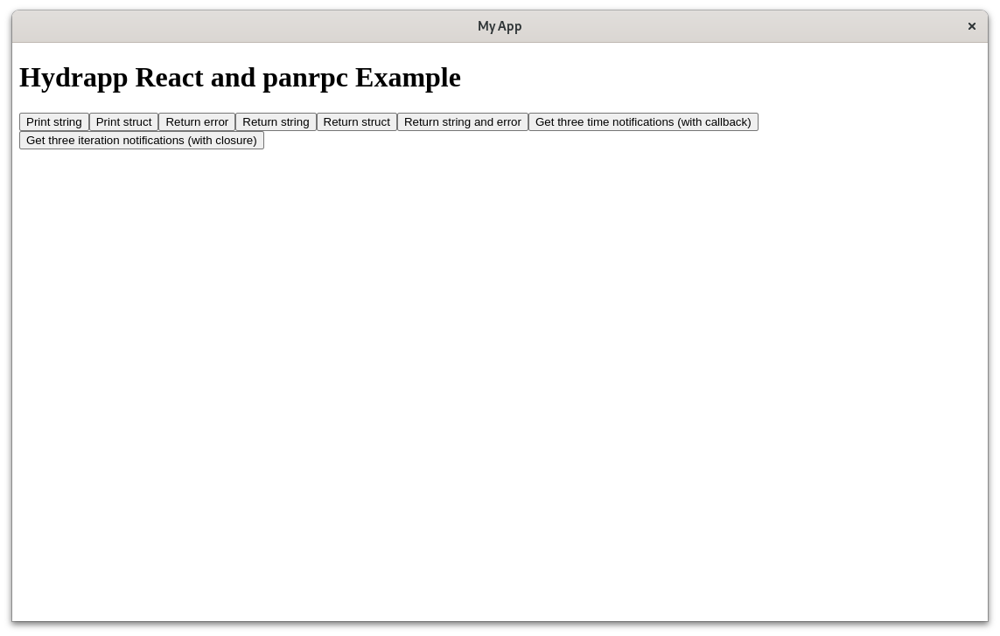

# hydrapp

Build fast apps that run everywhere with Go and a browser engine of your choice.

<br/>

[](https://github.com/pojntfx/hydrapp/actions/workflows/hydrapp.yaml)
[](https://github.com/pojntfx/hydrapp/actions/workflows/hydrun.yaml)
[](https://github.com/pojntfx/hydrapp/actions/workflows/docker.yaml)

[](https://pkg.go.dev/github.com/pojntfx/hydrapp/hydrapp)
[](https://matrix.to/#/#hydrapp:matrix.org?via=matrix.org)

## Overview

hydrapp is a small Go framework similar to Electron with unique feature: It **can use (almost) any browser engine** to render the frontend!

It enables you too ...

- **Build apps in Go and JS:** Use the speedy and easy-to-learn Go language to create your app's backend, then use your web tech know-how to develop a top-notch, user-friendly frontend.
- **Connect frontend and backend with ease:** With hydrapp and [panrpc](https://github.com/pojntfx/panrpc), you can easily call functions between the frontend and backend without any complicated manual setup.
- **Compatible with all browsers:** Hydrapp works with any pre-installed browser by starting it in PWA mode, so you can render your app on Chrome, Firefox/Gecko, Epiphany/Webkit, and even Android WebView.
- **Cross-compile easily with full CGo support:** Hydrapp simplifies cross-compilation with a container-based environment that includes MacPorts, MSYS2 on WINE, APT, and DNF, making it easy to distribute binaries without using non-Linux machines.
- **Effortlessly build, sign, distribute, and update your app:** Hydrapp streamlines your app's delivery with an integrated CI/CD workflow, producing reproducible packages for DEB, RPM, Flatpak, MSI, EXE, DMG, APK, and static binaries for all other platforms. Hydrapp can also generate APT, YUM, and Flatpak repositories for Linux and F-Droid repositories for Android. Self-updating for Windows, macOS, and other platforms is also available.

## Installation

hydrapp comes with a CLI to help with building and generating projects. While not required, it makes getting started a lot easier.

Its static binaries are available on [GitHub releases](https://github.com/pojntfx/hydrapp/releases).

On Linux, you can install them like so:

```shell
$ curl -L -o /tmp/hydrapp "https://github.com/pojntfx/hydrapp/releases/latest/download/hydrapp.linux-$(uname -m)"
$ sudo install /tmp/hydrapp /usr/local/bin
```

On macOS, you can use the following:

```shell
$ curl -L -o /tmp/hydrapp "https://github.com/pojntfx/hydrapp/releases/latest/download/hydrapp.darwin-$(uname -m)"
$ sudo install /tmp/hydrapp /usr/local/bin
```

On Windows, the following should work (using PowerShell as administrator):

```shell
PS> Invoke-WebRequest https://github.com/pojntfx/hydrapp/releases/latest/download/hydrapp.windows-x86_64.exe -OutFile \Windows\System32\hydrapp.exe
```

You can find binaries for more operating systems and architectures on [GitHub releases](https://github.com/pojntfx/hydrapp/releases).

## Tutorial

### 1. Creating a New Project

First, generate a new project by running `hydrapp new`, which will ask you some questions interactively. First, let's select the project type we want to start from; see [examples](#examples) for more information on the individual project types - for this example we'll use the `react-panrpc` template, which is the most full-featured one:

```shell
$ hydrapp new
? Which project type do you want to generate?:
    vanillajs-rest: Simple starter project with a REST API to connect the Vanilla JS frontend and backend
    vanillajs-forms: Traditional starter project with Web 1.0-style forms to connect the Vanilla JS frontend and backend
  ▸ react-panrpc: Complete starter project with panrpc RPCs to connect the React frontend and backend
```

Next, let's select the app ID in reverse domain notation; for this example we'll assume that the project will be hosted on GitHub:

```shell
✔ App ID in reverse domain notation: com.github.myusername.myapp
```

The app name, summary, description, homepage and Git repository follow the same schema:

```shell
App name: My App
✔ App summary: My first app
✔ App description: My first application, built with hydrapp.
✔ App description: My first application, built with hydrapp.
App homepage: https://github.com/myusername/myapp
✔ App git repo: https://github.com/myusername/myapp.git
```

Next up we'll set the base URL, which is the URL that the generated builds will be hosted on; for this example we'll assume that they will be hosted on GitHub pages:

```shell
✔ App base URL to expect the built assets to be published to: https://myusername.github.io/myapp/
```

For the Go module name, we'll use the GitHub repo:

```shell
✔ Go module name: github.com/myusername/myapp
```

Now we can set a license by choosing a SPDX identifier; note that this **has** to be a valid [SPDX identifier](https://spdx.org/licenses/) as it downloads the license text:

```shell
License SPDX identifier (see https://spdx.org/licenses/): Apache-2.0
```

Next up we enter the author name and email for release information:

```shell
Release author name: Jean Doe
Release author email: jean.doe@example.com
```

And finally we select a directory to create app in and skip advanced configuration:

```shell
Directory to write the app to: .
? Do you want to do any advanced configuration?:
  ▸ no
    yes
```

The release author name, author email and directory are self-explanatory:

```plaintext
Release author name: Jean Doe
Release author email: jean.doe@example.com
Directory to write the app to: .
```

Finally, you can choose to do advanced configuration; in this basic introduction, we won't be doing that:

```plaintext
? Do you want to do any advanced configuration?:
  ▸ no
    yes
```

After pressing <kbd>Enter</kbd>, the project will be generated, dependencies will be installed and the instructions for continuing will be displayed:

```shell
2024/04/22 22:43:39 Fetching full license text from SPDX ...
2024/04/22 22:43:39 Success!
Succesfully generated application. To start it, run the following:

cd myapp
go run .

You can find more information in the generated README.
```

**Congratulations!** You've created your first hydrapp app. Next, let's start it!

### 2. Starting the New Project

Now that we've created the app, we can start it. To do so, simply follow the instructions that were printed in the last command, which should look something like this:

```shell
cd myapp
go run .
```

After starting the app, you should see the generated app open like so:



**Cheers!** You've started your first hydrapp app. Next, let's find out how we can iterate efficiently on it!

🚧 This project is a work-in-progress! Instructions will be added as soon as it is usable. 🚧

## Reference

### Examples

To make getting started with hydrapp easier, take a look at the following examples:

- [**Vanilla JS and REST**](./hydrapp-example-vanillajs-rest/): Simple starter project with a REST API to connect the Vanilla JS frontend and backend
- [**Vanilla JS and Forms**](./hydrapp-example-vanillajs-forms/): Traditional starter project with Web 1.0-style forms to connect the Vanilla JS frontend and backend
- [**React and panrpc**](./hydrapp-example-react-panrpc/): Complete starter project with panrpc RPCs to connect the React frontend and backend

### Command Line Arguments

```shell
$ hydrapp --help
Build apps that run everywhere with Go and a browser engine of your choice (Chrome, Firefox, Epiphany or Android WebView).
Find more information at:
https://github.com/pojntfx/hydrapp

Usage:
  hydrapp [command]

Available Commands:
  build       Build a hydrapp project
  completion  Generate the autocompletion script for the specified shell
  help        Help about any command
  new         Generate a new hydrapp project
  secrets     Manage secrets

Flags:
  -h, --help             help for hydrapp
      --secrets string   Secrets file to use (default "/home/pojntfx/.local/share/hydrapp/secrets.yaml")

Use "hydrapp [command] --help" for more information about a command.
```

<details>
  <summary>Expand subcommand reference</summary>

#### New

```shell
$ hydrapp new --help
Generate a new hydrapp project

Usage:
  hydrapp new [flags]

Aliases:
  new, n

Flags:
  -h, --help         help for new
      --no-network   Disable all network interaction

Global Flags:
      --secrets string   Secrets file to use (default "/home/pojntfx/.local/share/hydrapp/secrets.yaml")
```

#### Build

```shell
$ hydrapp build --help
Build a hydrapp project

Usage:
  hydrapp build [flags]

Aliases:
  build, b

Flags:
      --branch-id string                   Branch ID to build the app as, i.e. main (for an app ID like "myappid.main" and baseURL like "mybaseurl/main" (default "main")
      --branch-name string                 Branch name to build the app as, i.e. Main (for an app name like "myappname (Main)" (default "Main")
      --concurrency int                    Maximum amount of concurrent builders to run at once (default 1)
      --config string                      Config file to use (default "hydrapp.yaml")
      --dst string                         Output directory (must be absolute path) (default "/home/pojntfx/out")
      --eject                              Write platform-specific config files (AndroidManifest.xml, .spec etc.) to directory specified by --src, then exit (--exclude still applies)
      --exclude string                     Regex of platforms and architectures not to build for, i.e. (apk|dmg|msi/386|flatpak/amd64)
  -h, --help                               help for build
      --java-certificate-password string    Java/APK certificate password (base64-encoded) (if keystore uses PKCS12, this will be the same as --java-keystore-password)
      --java-keystore string               Path to Java/APK keystore (neither path nor content should be not base64-encoded)
      --java-keystore-password string      Java/APK keystore password (base64-encoded)
      --no-network                         Disable all network interaction
      --overwrite                          Overwrite platform-specific config files even if they exist
      --pgp-key string                     Path to armored PGP private key (neither path nor content should be not base64-encoded)
      --pgp-key-id string                  PGP key ID (base64-encoded)
      --pgp-key-password string            PGP key password (base64-encoded)
      --pull                               Whether to pull the images or not
      --src string                         Source directory (must be absolute path) (default "/home/pojntfx")
      --tag string                         Image tag to use (default "latest")

Global Flags:
      --secrets string   Secrets file to use (default "/home/pojntfx/.local/share/hydrapp/secrets.yaml")
```

#### Secrets New

```shell
$ hydrapp secrets new --help
Generate new hydrapp secrets

Usage:
  hydrapp secrets new [flags]

Aliases:
  new, n

Flags:
  -h, --help                                 help for new
      --java-certificate-alias string        Java/APK certificate alias (default "Anonymous Hydrapp Developer")
      --java-certificate-cname string        Java/APK certificate CNAME (default "Anonymous Hydrapp Developer")
      --java-certificate-password string     Java/APK certificate password (auto-generated if not specified)
      --java-certificate-validity duration   Java/APK certificate validty (default 8760h0m0s)
      --java-keystore-password string        Java/APK keystore password (auto-generated if not specified)
      --java-rsa-bits uint32                 Java/APK RSA bits (default 2048)
      --pgp-key-email string                 PGP key E-Mail (default "test@example.com")
      --pgp-key-full-name string             PGP key full name (default "Anonymous Hydrapp Developer")
      --pgp-key-password string              PGP key password (auto-generated if not specified)

Global Flags:
      --secrets string   Secrets file to use (default "/home/pojntfx/.local/share/hydrapp/secrets.yaml")
```

#### Secrets Show

```shell
$ hydrapp secrets show --help
Show hydrapp secrets as env variables

Usage:
  hydrapp secrets show [flags]

Aliases:
  show, s

Flags:
  -h, --help   help for show

Global Flags:
      --secrets string   Secrets file to use (default "/home/pojntfx/.local/share/hydrapp/secrets.yaml")
```

</details>

### Environment Variables

All command line arguments described above can also be set using environment variables; for example, to set `--eject` to `true` with an environment variable, use `HYDRAPP_EJECT=true`.

## Acknowledgements

- [zserge/lorca](https://github.com/zserge/lorca) provided the initial inspiration for this project.
- [manifoldco/promptui](https://github.com/manifoldco/promptui) provides the TUI library.
- [ncruces/zenity](https://github.com/ncruces/zenity) provides the CGo-less dialog system used for scheduling updates.
- [MSYS2](https://www.msys2.org/) provides the package manager used for Windows builds with CGo support.
- [WINE](https://www.winehq.org/) allows for running MSYS2 inside a Docker container.
- [tpoechtrager/osxcross](https://github.com/tpoechtrager/osxcross) enables CGo cross-compilation from Linux to macOS.
- [indygreg/apple-platform-rs](https://github.com/indygreg/apple-platform-rs) enables code-signing macOS binaries from Linux.

## Contributing

To contribute, please use the [GitHub flow](https://guides.github.com/introduction/flow/) and follow our [Code of Conduct](./CODE_OF_CONDUCT.md).

To build and start a development version of one of the examples locally, run the following:

```shell
$ git clone https://github.com/pojntfx/hydrapp.git
$ cd hydrapp
$ make depend/hydrapp-example-react-panrpc
$ go run ./hydrapp-example-react-panrpc
```

This project uses [Go workspaces](https://go.dev/doc/tutorial/workspaces), so any changes you make to the `hydrapp` module should be used by the examples without any manual adjustments.

Have any questions or need help? Chat with us [on Matrix](https://matrix.to/#/#hydrapp:matrix.org?via=matrix.org)!

## License

hydrapp (c) 2024 Felicitas Pojtinger and contributors

SPDX-License-Identifier: Apache-2.0
