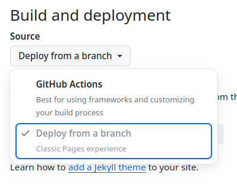
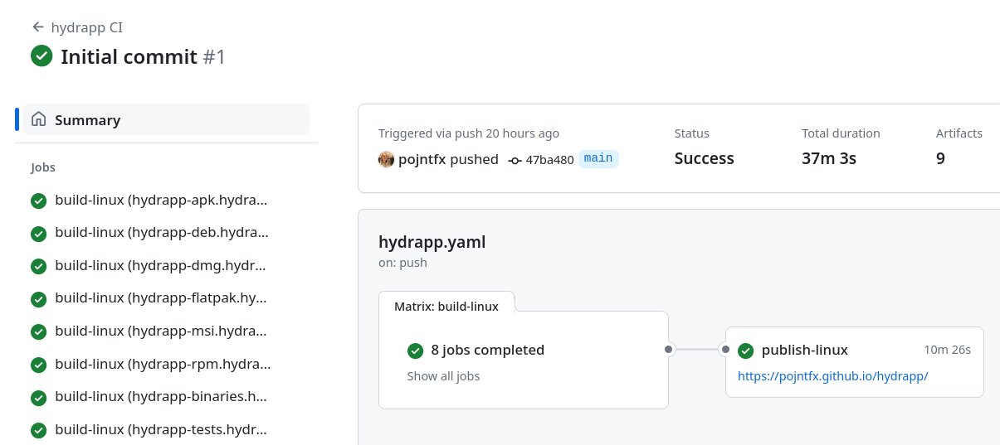

# hydrapp

Build fast apps that run everywhere with Go and a browser engine of your choice.

<br/>


[](https://github.com/pojntfx/hydrapp/actions/workflows/hydrapp.yaml)
[](https://github.com/pojntfx/hydrapp/actions/workflows/hydrun.yaml)

[](https://pkg.go.dev/github.com/pojntfx/hydrapp/hydrapp)
[](https://matrix.to/#/#hydrapp:matrix.org?via=matrix.org)

## Overview

hydrapp is a small Go framework similar to Electron with a unique feature: It **can use (almost) any browser engine** to render the frontend!

It enables you to:

- **Build apps in Go and JS:** Use the speedy and easy-to-learn Go language to create your app's backend, then use your web tech know-how to develop a top-notch, user-friendly frontend.
- **Connect frontend and backend with ease:** With hydrapp and [panrpc](https://github.com/pojntfx/panrpc), you can easily call functions between the frontend and backend without any complicated manual setup.
- **Compatible with all browsers:** hydrapp works with any pre-installed browser by starting it in PWA mode, so you can render your app on Chrome, Edge, Brave, Firefox/Gecko, Epiphany/Webkit/GNOME Web, and even Android WebView.
- **Cross-compile easily with full CGo support:** hydrapp simplifies cross-compilation with a container-based environment that includes MacPorts, MSYS2 on WINE, APT, and DNF, making it easy to distribute binaries without using any non-Linux machines.
- **Effortlessly build, sign, distribute, and update your app:** hydrapp streamlines your app's delivery with an integrated CI/CD workflow, producing reproducible packages for DEB, RPM, Flatpak, MSI, DMG, APK, and static binaries for all other platforms. hydrapp can also generate APT, DNF/YUM, and Flatpak repositories for Linux and F-Droid repositories for Android. Self-updating for Windows, macOS, and other platforms is also available.

## Installation

hydrapp comes with a CLI to help with building and generating projects. While not required, it makes getting started a lot easier.

Its static binaries are available on [GitHub releases](https://github.com/pojntfx/hydrapp/releases).

On Linux, you can install them like so:

```shell
$ curl -L -o /tmp/hydrapp "https://github.com/pojntfx/hydrapp/releases/latest/download/hydrapp.linux-$(uname -m)"
$ sudo install /tmp/hydrapp /usr/local/bin
```

On macOS, you can use the following:

```shell
$ curl -L -o /tmp/hydrapp "https://github.com/pojntfx/hydrapp/releases/latest/download/hydrapp.darwin-$(uname -m)"
$ sudo install /tmp/hydrapp /usr/local/bin
```

On Windows, the following should work (using PowerShell as administrator):

```shell
PS> Invoke-WebRequest https://github.com/pojntfx/hydrapp/releases/latest/download/hydrapp.windows-x86_64.exe -OutFile \Windows\System32\hydrapp.exe
```

You can find binaries for more operating systems and architectures on [GitHub releases](https://github.com/pojntfx/hydrapp/releases).

## Tutorial

### 1. Creating a New App

First, generate a new app by running `hydrapp new`, which will ask you some questions interactively. First, let's select the project type we want to start from; see [examples](#examples) for more information on the individual project types - for this example we'll use the `react-panrpc` template, which is the most full-featured one:

```shell
$ hydrapp new
? Which project type do you want to generate?:
    vanillajs-rest: Simple starter project with a REST API to connect the Vanilla JS frontend and backend
    vanillajs-forms: Traditional starter project with Web 1.0-style forms to connect the Vanilla JS frontend and backend
  ▸ react-panrpc: Complete starter project with panrpc RPCs to connect the React frontend and backend
```

Next, let's select the app ID in reverse domain notation; for this example we'll assume that the project will be hosted on GitHub:

```shell
✔ App ID in reverse domain notation: com.github.myusername.myapp
```

The app name, summary, description, homepage and Git repository follow the same schema:

```shell
App name: My App
✔ App summary: My first app
✔ App description: My first application, built with hydrapp.
✔ App description: My first application, built with hydrapp.
App homepage: https://github.com/myusername/myapp
✔ App git repo: https://github.com/myusername/myapp.git
```

Next up we'll set the base URL, which is the URL that the generated builds will be hosted on; for this example we'll assume that they will be hosted on GitHub pages:

```shell
✔ App base URL to expect the built assets to be published to: https://myusername.github.io/myapp/
```

For the Go module name, we'll use the GitHub repo:

```shell
✔ Go module name: github.com/myusername/myapp
```

Now we can set a license by choosing a SPDX identifier; note that this **has** to be a valid [SPDX identifier](https://spdx.org/licenses/) as it downloads the license text:

```shell
License SPDX identifier (see https://spdx.org/licenses/): Apache-2.0
```

Next up we enter the author name and email for release information:

```shell
Release author name: Jean Doe
Release author email: jean.doe@example.com
```

And finally we select a directory to create app in and skip advanced configuration:

```shell
Directory to write the app to: .
? Do you want to do any advanced configuration?:
  ▸ no
    yes
```

The release author name, author email and directory are self-explanatory:

```plaintext
Release author name: Jean Doe
Release author email: jean.doe@example.com
Directory to write the app to: .
```

Finally, you can choose to do advanced configuration; in this basic introduction, we won't be doing that:

```plaintext
? Do you want to do any advanced configuration?:
  ▸ no
    yes
```

After pressing <kbd>Enter</kbd>, the project will be generated, dependencies will be installed and the instructions for continuing will be displayed:

```shell
2024/04/22 22:43:39 Fetching full license text from SPDX ...
2024/04/22 22:43:39 Success!
Succesfully generated application. To start it, run the following:

cd myapp
go run .

You can find more information in the generated README.
```

**Congratulations!** You've created your first hydrapp app. Next, let's start it!

### 2. Starting The App

Now that we've created the app, we can start it. To do so, simply follow the instructions that were printed in the last command, which should look something like this:

```shell
cd myapp
go run .
```

Alternatively, you can also see the instructions in the generated `README.md` file. After starting the app, you should see it open like so:


**Cheers!** You've started your first hydrapp app. Next, let's find out how we can iterate efficiently on it!

### 3. Iterating on The App

Now that we've started the app in its own window, let's make some changes to it. While it's possible to iterate on the app window as well, it's usually easier to do so using your browser instead - this way, you have access to familiar tools such as hot-reloading, your debugging extensions and so on. How to do so depends on the project type you've chosen (see the generated `README.md` file), but for this example they will look something like this:

```shell
$ cd myapp
# Start the backend in the first terminal
$ HYDRAPP_BACKEND_LADDR=localhost:1337 HYDRAPP_TYPE=dummy go run .
# Start the frontend in a second terminal
$ cd myapp/pkg/frontend
$ npm run dev
# Now open http://localhost:1234 in your browser
```

After opening [http://localhost:1234](http://localhost:1234) or the URL that is described in your generated `README.md`, you should be able to debug your frontend and backend just like you would with any web app:


If you make changes to the frontend, they will be reloaded automatically, and if you make changes to the backend, they'll be visible after restarting the server; for example, you can edit `myapp/pkg/frontend/src/App.tsx` to change the title of the app, and this change will be immediately visible without needing to reload:


**Enjoy your development environment!** Feel free to change more things or even add new functionality. Next, let's find out how we can package our app!

### 4. Packaging The App

While we can of course package our app using the standard `go build` command, distributing our app this way means that things such as getting updates for the app, adding a launcher to the system or shipping it to mobile devices can be quite challenging. To make this process easier, hydrapp includes a way to easily package your app using each system's individual package format (DEB, RPM, Flatpak, MSI, DMG, APK, and static binaries for all other platforms) through `hydrapp build`, all without having to install any dependencies and full support for CGo. The generated `README.md` file should also include these instructions, but for this example they will look something like this:

```shell
$ hydrapp build
# You can find the built packages in the out/ directory
```

If you only want to build certain packages or for certain architectures, for example to only build the APKs, pass `--exclude` like in the following:

```shell
$ hydrapp build --exclude '(binaries|deb|rpm|flatpak|msi|dmg|docs|tests)'
```

The output directory should now contain the built packages. For example, if you chose to only build the APKs, it should look something like this:

```shell
$ tree out/
out/
└── apk
    └── main
        # ...
        ├── repo
        # ...
        │   ├── com.github.example.myapp.main.apk
        │   ├── com.github.example.myapp.main.apk.asc
        # ...
```

**Well done!** You've successfully built a native system package for your app. Next, let's find out how you can distribute it to your users!

### 5. Publishing the App

While we can of course manually copy the contents of the `out` directory and distribute the native system packages to our users this way, it is much easier to use a repository and CI/CD action to build, distribute and update them automatically. We'll use GitHub Actions to build the native system packages and GitHub Pages to distribute them in this example (we've specified the `github.com/myusername/myapp` repository in [1. Creating a New App](#1-creating-a-new-app) earlier), but you are of course free to use any alternative forge such as [Gitea/Forgejo](https://forgejo.org/) or [GitLab](https://about.gitlab.com/) or even your own web server if you prefer.

Let's start with creating our repository by visiting [github.com/new](https://github.com/new). After creating the repository, navigate to `Settings → Pages` to enable GitHub Pages. hydrapp defaults to using the branch-based GitHub Pages workflow, which allows you to publish multiple versions of your app simultaneously (see [How can I provide an alpha, beta, insider etc. channel/edition/version of my app?](#how-can-i-provide-an-alpha-beta-insider-etc-channeleditionversion-of-my-app) for more information). To enable this, set the source to "Deploy from a branch" like so:

<p align="center">
  
</p>

The second step is to add the PGP and Java secrets to the repository we've just created; these are automatically generated by `hydrapp` when you run `hydrapp build` for the first time on your machine; if you want to customize them, see the [`secrets new` command reference](#secrets-new). You can show them by running `hydrapp secrets show` like so:

```shell
$ hydrapp secrets show
export JAVA_KEYSTORE="..."
export JAVA_KEYSTORE_PASSWORD="..."
export JAVA_CERTIFICATE_PASSWORD="..."
export PGP_KEY="..."
export PGP_KEY_ID="..."
export PGP_KEY_PASSWORD="..."
```

These secrets can now be added to the GitHub repository by heading to `Settings → Secrets and variables → Actions` in the repository, clicking on "New repository secret" and entering the value from `hydrapp secrets show` for each of them (there is no need to include the `"` characters or `export`):

<p align="center">
  
</p>

Once you've added all of them, they should look like this:

<p align="center">
  
</p>

Now that you've added the secrets to the repository, you can push the app to it like so (be sure to adjust `git@github.com:myusername/myapp.git` to the repository URL we've specified in [1. Creating a New App](#1-creating-a-new-app) earlier):

```shell
$ git init
$ git add .
$ git commit -m "Initial commit"
$ git remote add origin git@github.com:myusername/myapp.git
$ git push -u origin main
```

After pushing the app to the repository, the GitHub action should automatically start building the app. You should be able to follow along by heading to `Actions → hydrapp CI` in the repository; after it has finished the output should look something like this:

<p align="center">
  
</p>

Once the action has run, the generated packages and installation instructions are ready for publishing to GitHub Pages. This process usually happens automatically with the action, but the first deployment requires a manual step. To do this, navigate to `Settings → Pages` and select the `gh-pages` branch, as shown below:

<p align="center">
  
</p>

After saving your changes, GitHub will begin deploying to GitHub Pages. You can track the deployment's progress by visiting `Actions → pages-build-deployment`. The link to the installation instructions can be found in the generated `README.md` or at the URL provided by the earlier `publish-linux` action. It should look something like this:


Once your users install the app using these instructions, they'll receive updates automatically, either through their system's native package manager (for DEBs, RPMs, Flatpaks and APKs) or hydrapp's own self-updater (for MSIs, DMGs and static binaries for all other platforms).

**🚀 That's it!** You've successfully created, started, iterated on, packaged and published your first hydrapp app. We can't wait to see what you're going to build next with hydrapp! Be sure to take a look at the [reference](#reference), [examples](#examples), [showcase](#showcase) and [frequently asked questions](#faq) for more information.

## Reference

### Examples

To make getting started with hydrapp easier, take a look at the following examples:

- [**Vanilla JS and REST**](./hydrapp-example-vanillajs-rest/): Simple starter project with a REST API to connect the Vanilla JS frontend and backend
- [**Vanilla JS and Forms**](./hydrapp-example-vanillajs-forms/): Traditional starter project with Web 1.0-style forms to connect the Vanilla JS frontend and backend
- [**React and panrpc**](./hydrapp-example-react-panrpc/): Complete starter project with panrpc RPCs to connect the React frontend and backend

### Showcase

If you want to see how hydrapp is being used in production, take a look the following apps:

- [**Connmapper**](https://github.com/pojntfx/connmapper): An app to visualize your system's internet connections on a globe <br/> <a display="inline" href="https://github.com/pojntfx/connmapper">
  
  </a>
- [**LatenSee**](https://github.com/loopholelabs/latensee): A Valkey/Redis latency visualization tool <br/> <a display="inline" href="https://github.com/loopholelabs/latensee">
  
  </a>

### Command Line Arguments

```shell
$ hydrapp --help
Build apps that run everywhere with Go and a browser engine of your choice (Chrome, Firefox, Epiphany or Android WebView).
Find more information at:
https://github.com/pojntfx/hydrapp

Usage:
  hydrapp [command]

Available Commands:
  build       Build a hydrapp project
  completion  Generate the autocompletion script for the specified shell
  help        Help about any command
  new         Generate a new hydrapp project
  secrets     Manage secrets

Flags:
  -h, --help             help for hydrapp
      --secrets string   Secrets file to use (default "/home/pojntfx/.local/share/hydrapp/secrets.yaml")

Use "hydrapp [command] --help" for more information about a command.
```

<details>
  <summary>Expand subcommand reference</summary>

#### New

```shell
$ hydrapp new --help
Generate a new hydrapp project

Usage:
  hydrapp new [flags]

Aliases:
  new, n

Flags:
      --experimental-github-pages-action   (Experimental) Use the GitHub Actions-based deploy strategy for GitHub pages instead of pushing to the gh-pages branch in the generated CI/CD configuration (disables support for publishing more than one hydrapp branch)
  -h, --help                               help for new
      --no-network                         Disable all network interaction

Global Flags:
      --secrets string   Secrets file to use (default "/home/pojntfx/.local/share/hydrapp/secrets.yaml")
```

#### Build

```shell
$ hydrapp build --help
Build a hydrapp project

Usage:
  hydrapp build [flags]

Aliases:
  build, b

Flags:
      --branch-id string                   Branch ID to build the app as, i.e. main (for an app ID like "myappid.main" and baseURL like "mybaseurl/main" (default "main")
      --branch-name string                 Branch name to build the app as, i.e. Main (for an app name like "myappname (Main)" (default "Main")
      --concurrency int                    Maximum amount of concurrent builders to run at once (default 1)
      --config string                      Config file to use (default "hydrapp.yaml")
      --dst string                         Output directory (must be absolute path) (default "/home/pojntfx/out")
      --eject                              Write platform-specific config files (AndroidManifest.xml, .spec etc.) to directory specified by --src, then exit (--exclude still applies)
      --exclude string                     Regex of platforms and architectures not to build for, i.e. (apk|dmg|msi/386|flatpak/amd64)
  -h, --help                               help for build
      --java-certificate-password string    Java/APK certificate password (base64-encoded) (if keystore uses PKCS12, this will be the same as --java-keystore-password)
      --java-keystore string               Path to Java/APK keystore (neither path nor content should be not base64-encoded)
      --java-keystore-password string      Java/APK keystore password (base64-encoded)
      --no-network                         Disable all network interaction
      --overwrite                          Overwrite platform-specific config files even if they exist
      --pgp-key string                     Path to armored PGP private key (neither path nor content should be not base64-encoded)
      --pgp-key-id string                  PGP key ID (base64-encoded)
      --pgp-key-password string            PGP key password (base64-encoded)
      --pull                               Whether to pull the images or not
      --src string                         Source directory (must be absolute path) (default "/home/pojntfx")
      --tag string                         Image tag to use (default "latest")

Global Flags:
      --secrets string   Secrets file to use (default "/home/pojntfx/.local/share/hydrapp/secrets.yaml")
```

#### Secrets New

```shell
$ hydrapp secrets new --help
Generate new hydrapp secrets

Usage:
  hydrapp secrets new [flags]

Aliases:
  new, n

Flags:
  -h, --help                                 help for new
      --java-certificate-alias string        Java/APK certificate alias (default "Anonymous hydrapp Developer")
      --java-certificate-cname string        Java/APK certificate CNAME (default "Anonymous hydrapp Developer")
      --java-certificate-password string     Java/APK certificate password (auto-generated if not specified)
      --java-certificate-validity duration   Java/APK certificate validty (default 8760h0m0s)
      --java-keystore-password string        Java/APK keystore password (auto-generated if not specified)
      --java-rsa-bits uint32                 Java/APK RSA bits (default 2048)
      --pgp-key-email string                 PGP key E-Mail (default "test@example.com")
      --pgp-key-full-name string             PGP key full name (default "Anonymous hydrapp Developer")
      --pgp-key-password string              PGP key password (auto-generated if not specified)

Global Flags:
      --secrets string   Secrets file to use (default "/home/pojntfx/.local/share/hydrapp/secrets.yaml")
```

#### Secrets Show

```shell
$ hydrapp secrets show --help
Show hydrapp secrets as environment variables

Usage:
  hydrapp secrets show [flags]

Aliases:
  show, s

Flags:
  -h, --help   help for show

Global Flags:
      --secrets string   Secrets file to use (default "/home/pojntfx/.local/share/hydrapp/secrets.yaml")
```

</details>

### Environment Variables

All command line arguments described above can also be set using environment variables; for example, to set `--eject` to `true` with an environment variable, use `HYDRAPP_EJECT=true`.

## FAQ

### Which browsers are supported?

Apps built with hydrapp officially support and are pre-configured for the following browsers:

<details>
  <summary>Expand supported browser list</summary>

- **Linux:**
  - **Chromium-like browsers:**
    - Google Chrome (with binary `google-chrome`)
    - Google Chrome Stable (with binary `google-chrome-stable`)
    - Google Chrome Beta (with binary `google-chrome-beta`)
    - Google Chrome Unstable (with binary `google-chrome-unstable`)
    - Brave Browser (with binary `brave-browser`)
    - Brave Browser Stable (with binary `brave-browser-stable`)
    - Brave Browser Beta (with binary `brave-browser-beta`)
    - Brave Browser Nightly (with binary `brave-browser-nightly`)
    - Microsoft Edge (with binary `microsoft-edge`)
    - Microsoft Edge Beta (with binary `microsoft-edge-beta`)
    - Microsoft Edge Dev (with binary `microsoft-edge-dev`)
    - Microsoft Edge Canary (with binary `microsoft-edge-canary`)
    - Ungoogled Chromium (with binary `ungoogled-chromium`)
    - Chromium Browser (with binary `chromium-browser`)
    - Chromium (with binary `chromium`)
    - Google Chrome (with Flatpak `com.google.Chrome`)
    - Google Chrome Dev (with Flatpak `com.google.ChromeDev`)
    - Brave Browser (with Flatpak `com.brave.Browser`)
    - Microsoft Edge (with Flatpak `com.microsoft.Edge`)
    - Chromium (with Flatpak `org.chromium.Chromium`)
    - Ungoogled Chromium (with Flatpak `com.github.Eloston.UngoogledChromium`)
  - **Firefox-like browsers:**
    - Firefox (with binary `firefox`)
    - Firefox ESR (with binary `firefox-esr`)
    - Firefox (with Flatpak `org.mozilla.firefox`)
  - **GNOME Web/Epiphany-like browsers:**
    - GNOME Web/Epiphany (with binary `epiphany`)
    - GNOME Web/Epiphany (with Flatpak `org.gnome.Epiphany`)
  - **Lynx-like browsers:**
    - Lynx (with binary `lynx`)
- **Windows:**
  - **Chromium-like browsers:**
    - Google Chrome (with binary `Google\Chrome\Application\chrome.exe`)
    - Google Chrome Beta (with binary `Google\Chrome Beta\Application\chrome.exe`)
    - Google Chrome SxS (with binary `Google\Chrome SxS\Application\chrome.exe`)
    - Brave Browser (with binary `BraveSoftware\Brave-Browser\Application\brave.exe`)
    - Brave Browser Beta (with binary `BraveSoftware\Brave-Browser-Beta\Application\brave.exe`)
    - Brave Browser Nightly (with binary `BraveSoftware\Brave-Browser-Nightly\Application\brave.exe`)
    - Microsoft Edge (with binary `Microsoft\Edge\Application\msedge.exe`)
    - Microsoft Edge Beta (with binary `Microsoft\Edge Beta\Application\msedge.exe`)
    - Microsoft Edge Dev (with binary `Microsoft\Edge Dev\Application\msedge.exe`)
    - Microsoft Edge Canary (with binary `Microsoft\Edge Canary\Application\msedge.exe`)
    - Chromium (with binary `Chromium\Application\chrome.exe`)
  - **Firefox-like browsers:**
    - Mozilla Firefox (with binary `Mozilla Firefox\firefox.exe`)
    - Firefox Nightly (with binary `Firefox Nightly\firefox.exe`)
- **macOS:**
  - **Chromium-like browsers:**
    - Google Chrome (with binary `Google Chrome.app/Contents/MacOS/Google Chrome`)
    - Google Chrome Beta (with binary `Google Chrome Beta.app/Contents/MacOS/Google Chrome Beta`)
    - Google Chrome Canary (with binary `Google Chrome Canary.app/Contents/MacOS/Google Chrome Canary`)
    - Brave Browser (with binary `Brave Browser.app/Contents/MacOS/Brave Browser`)
    - Brave Browser Beta (with binary `Brave Browser Beta.app/Contents/MacOS/Brave Browser Beta`)
    - Brave Browser Nightly (with binary `Brave Browser Nightly.app/Contents/MacOS/Brave Browser Nightly`)
    - Microsoft Edge (with binary `Microsoft Edge.app/Contents/MacOS/Microsoft Edge`)
    - Microsoft Edge Beta (with binary `Microsoft Edge Beta.app/Contents/MacOS/Microsoft Edge Beta`)
    - Microsoft Edge Dev (with binary `Microsoft Edge Dev.app/Contents/MacOS/Microsoft Edge Dev`)
    - Microsoft Edge Canary (with binary `Microsoft Edge Canary.app/Contents/MacOS/Microsoft Edge Canary`)
    - Chromium (with binary `Chromium.app/Contents/MacOS/Chromium`)
  - **Firefox-like browsers:**
    - Firefox (with binary `Firefox.app/Contents/MacOS/firefox`)
    - Firefox Nightly (with binary `Firefox Nightly.app/Contents/MacOS/firefox`)
- **Android**: Android WebView
  </details>

If you don't have any of these browsers installed, you can download one from here:

- Google Chrome: [https://www.google.com/chrome/](https://www.google.com/chrome/)
- Google Chrome (Flatpak): [https://flathub.org/apps/com.google.Chrome](https://flathub.org/apps/com.google.Chrome)
- Brave Browser: [https://brave.com/](https://brave.com/)
- Brave Browser (Flatpak): [https://flathub.org/apps/com.brave.Browser](https://flathub.org/apps/com.brave.Browser)
- Microsoft Edge: [https://microsoft.com/edge](https://microsoft.com/edge)
- Microsoft Edge (Flatpak): [https://flathub.org/apps/com.microsoft.Edge](https://flathub.org/apps/com.microsoft.Edge)
- Ungoogled Chromium: [https://github.com/ungoogled-software/ungoogled-chromium?tab=readme-ov-file#downloads](https://github.com/ungoogled-software/ungoogled-chromium?tab=readme-ov-file#downloads)
- Ungoogled Chromium (Flatpak): [https://flathub.org/apps/io.github.ungoogled_software.ungoogled_chromium](https://flathub.org/apps/io.github.ungoogled_software.ungoogled_chromium)
- Firefox: [https://mozilla.org/firefox](https://mozilla.org/firefox)
- Firefox (Flatpak): [https://flathub.org/apps/org.mozilla.firefox](https://flathub.org/apps/org.mozilla.firefox)
- GNOME Web/Epiphany: [https://apps.gnome.org/Epiphany](https://apps.gnome.org/Epiphany)
- GNOME Web/Epiphany (Flatpak): [https://flathub.org/apps/org.gnome.Epiphany](https://flathub.org/apps/org.gnome.Epiphany)
- Lynx: [https://lynx.invisible-island.net/](https://lynx.invisible-island.net/)

It is also possible to use an unsupported browser (or no browser at all), use a custom browser installation location or pick from one of the installed browsers by setting environment variables. By default, the following browser-related environment variables are available to hydrapp-based apps:

| Name                     | Description                                                                                                 |
| ------------------------ | ----------------------------------------------------------------------------------------------------------- |
| `HYDRAPP_BACKEND_LADDR`  | Listen address for the backend (`localhost:0` by default)                                                   |
| `HYDRAPP_FRONTEND_LADDR` | Listen address for the frontend (`localhost:0` by default)                                                  |
| `HYDRAPP_BROWSER`        | Binary of browser to display the frontend with                                                              |
| `HYDRAPP_TYPE`           | Type of browser to display the frontend with (one of `chromium`, `firefox`, `epiphany`, `lynx` and `dummy`) |

### How does hydrapp differ from Electron or Tauri?

**Electron** embeds Chromium, requiring each Electron app to ship with its own copy. This results in large bundle sizes and significant maintenance work to keep the embedded Chromium version up-to-date and secure. Additionally, Electron apps face challenges with cross-compilation, particularly when native C code or binary signing is involved, making it difficult to build for macOS or Windows from Linux.

It does also not support Android, offers only basic self-updating functionality, and lacks out-of-the-box support for modern Linux packaging formats like Flatpak (see [Electron's self-updating support](https://www.electronjs.org/docs/latest/tutorial/updates)). Moreover, Electron doesn't produce reproducible binaries or RPM/DEB source packages.

**Tauri** uses WebKit on Linux and macOS, and WebView2 (Chromium) on Windows (see [Tauri's webview versions](https://tauri.app/v1/references/webview-versions/)). However, WebKit lacks several modern web features, including some important Wasm features, particularly on Linux where WebRTC, for example, is not supported (see the [WebKitGTK issues](https://gitlab.gnome.org/GNOME/epiphany/-/issues/1185)). Tauri's Android support is still unstable (see [Tauri 2.0.0 Release Candidate](https://v2.tauri.app/blog/tauri-2-0-0-release-candidate/#development-server-for-mobile)).

Like Electron, Tauri also cannot be easily cross-compiled when native C code is involved, meaning a Mac is required to build macOS versions, and a Windows PC is required to build Windows versions (see [Tauri's cross-platform building guide](https://tauri.app/v1/guides/building/cross-platform/)). Additionally, Tauri requires considerable effort and boilerplate to package correctly for RPM and DEB (see [Tauri's RPM packaging guide](https://v2.tauri.app/distribute/rpm/)).

In contrast, **hydrapp** does not embed any browser. Instead, it leverages the system's installed browser (Chrome, Edge, Brave, Firefox/Gecko, Epiphany/Webkit/GNOME Web, and Android WebView) in app mode, resulting in much smaller bundle sizes. Since there's no need to ship a copy of Chromium, maintenance is simplified to managing a single browser installation and monitoring it for security vulnerabilities, which is usually taken care of by your operating system already. hydrapp also fully supports Android out of the box, including update distribution via F-Droid, and enables easy cross-compilation from a Linux machine to any supported platform, even with native C dependencies.

App distribution is integrated into hydrapp, and hydrapp-based applications can be deployed across platforms without relying on proprietary infrastructure or extensive configuration, requiring only a standard web server or services like GitHub pages. On platforms with free repository systems (e.g. Linux and Android), hydrapp seamlessly integrates by generating valid, signed repositories, while on those that lack such a system (e.g. Windows and macOS), a self-updater handles the task. Additionally, it generates self-describing installation guides for all platforms, produces fully reproducible binaries, and creates source packages for supported platforms, allowing users to easily rebuild a hydrapp app locally and verify hashes for added security.

### How do I disable builds for a specific platform like Windows or Debian?

To disable builds for a specific platform, simply delete their definition from the `hydrapp.yaml` file and remove the matching target from `.github/workflows/hydrapp.yaml`, after which they will neither be built by GitHub actions nor included in the generated installation instructions; also see [4. Packaging The App](#4-packaging-the-app) if you want to skip these builds locally.

### How do I include native dependencies, install additional build-time packages or use CGo?

The container-based system package build system allows you to cross-compile with CGo support for DEB, RPM, Flatpak, MSI, DMG and APK packages by default, and it also allows the declarative installation of build dependencies through MacPorts/MSYS2/APT/DNF etc. (like `sqlite`, `libpcap` etc.) by adding them to `hydrapp.yaml`. For example, to add `libpcap` to the build dependencies, the configuration might look like so:

```yaml
deb:
  - path: deb/debian/sid/x86_64
    os: debian
    distro: sid
    mirrorsite: http://http.us.debian.org/debian
    components:
      - main
      - contrib
    debootstrapopts: ""
    architecture: amd64
    packages:
      - name: libpcap-dev
        version: "1.10.4"
dmg:
  path: dmg
  packages:
    - libpcap
# Disable due to `libpcap` dependency
# flatpak:
# - path: flatpak/x86_64
#   architecture: amd64
msi:
  - path: msi/x86_64
    architecture: amd64
    include: ^\\b$
    packages:
      - libpcap
rpm:
  - path: rpm/fedora/40/x86_64
    trailer: fc40
    distro: fedora-40
    architecture: amd64
    packages:
      - name: libpcap-devel
        version: "1.10.4"
# Disable due to `libpcap` dependency
# apk:
#   path: apk
# Disable due to `libpcap` dependency
# binaries:
#   path: binaries
#   exclude: (android/*|ios/*|plan9/*|aix/*|linux/loong64|freebsd/riscv64|wasip1/wasm|js/wasm|openbsd/mips64)
#   packages: []
```

Note that while the DEB and RPM builds automatically include these packages as dependencies, for DMG and MSI builds, you must still ensure that the necessary runtime libraries are installed on your users' systems unless you manually set up static linking.

### How can I provide an alpha, beta, insider etc. channel/edition/version of my app?

hydrapp supports publishing different branches of your app by default through Git. The default branch is `main`, which is the latest release version; if you want to publish a beta version, it's as easy as creating a branch named `beta` and pushing to it, and the same goes for an `alpha` or `insider` edition. Installation instructions for these branches will be generated and published just like for the `main` branch, and the branches are integrated with the update system; you can find them by swapping out `main` in the URL with your branch name (e.g. `beta`).

Due to a [known limitation](https://github.com/actions/upload-pages-artifact/issues/57) with the GitHub Actions-based GitHub Pages workflow, hydrapp defaults to the branch-based GitHub Pages workflow. The primary drawback of this approach is that the built assets are stored in a branch of the repository, which can slow down clone operations. This issue is mitigated by automatically adding the `--single-branch` option to the generated installation instructions.

If you don't need support for publishing multiple branches of your app or prefer not to store the built assets in a branch, you can pass the `--experimental-github-pages-action` flag to `hydrapp new`. This will switch to the GitHub Actions-based GitHub Pages workflow, publishing built assets only for tagged releases, and not storing them in a branch of the repository itself. You must also [enable publishing with a custom GitHub Actions workflow](https://docs.github.com/en/pages/getting-started-with-github-pages/configuring-a-publishing-source-for-your-github-pages-site#publishing-with-a-custom-github-actions-workflow) to use this workflow as the source for your GitHub Pages configuration.

### How can I customize the MSI/WIX installer files, Android permissions, Flatpak configuration, RPM spec file etc.?

While the default configuration files should be usable for most applications, some apps might have different requirements (such as additional permissions, different metadata or deeper native integration). To allow for this, hydrapp can "eject" it's internal configuration files by passing `--eject` to `hydrapp build` like so:

```shell
$ hydrapp build --eject
```

This will render all the template configuration files using the values from `hydrapp.yaml` and write them to their respective locations. If you only want to change a specific configuration file (such as `AndroidManifest.xml` to add permissions to an Android app or `INSTALLATION.md` to modify the installation instructions), feel free to delete the ones you want to keep as in their default state - if hydrapp doesn't find an overwrite file, it falls back to the default internal one. You can also pass in `--overwrite` to overwrite your customizations with the default ones. hydrapp can eject all the following configuration files for maximum flexibility (based on the app from the [tutorial](#tutorial)):

```plaintext
├── AndroidManifest.xml # APK/Android activity configuration, metadata, permissions, minimum versions, app ID etc.
├── com.github.example.myapp.desktop # Desktop Linux app launcher metadata
├── com.github.example.myapp.json # Flatpak metadata, build configuration and dependencies
├── com.github.example.myapp.metainfo.xml # Desktop Linux app store metadata, license, changelog and description
├── com.github.example.myapp.spec # RPM build configuration, changelog and dependencies
├── com.github.example.myapp.wxl # MSI/WIX installer/Windows metadata, file registry entries and start menu configuration
├── config.yml # APK/Android F-Droid repositoy configuration
├── debian/* # DEB build configuration, changelog and dependencies
├── hydrapp_android.c # APK/Android/Java/JNI C functions
├── hydrapp_android.h # APK/Android/Java/JNI C headers
├── hydrapp.flatpakrepo # Flatpak repository
├── hydrapp.repo # DNF/YUM repository configuration for RPM package builds
├── icon-*x*.png # Resolution-specific icon
├── icon.icns # macOS-specific icon
├── icon.ico # Windows-specific icon
├── Info.plist # DMG/macOS launcher configuration
├── INSTALLATION.md # Markdown template for the auto-generated installation instructions
├── MainActivity.java # APK/Android/Java main activity
└── repo.conf # APT repository configuration for DEB package builds
```

For more information on ejecting, see the [`build` command reference](#build).

### How can I disable automatic updates?

hydrapp-based apps receive updates automatically, either through their system's native package manager (for DEBs, RPMs, Flatpaks and APKs) or hydrapp's own self-updater (for MSIs, DMGs and static binaries for all other platforms). To disable the integrated self-updater, set the `HYDRAPP_SELFUPDATE` environment variable to `false`.

## Acknowledgements

- [zserge/lorca](https://github.com/zserge/lorca) provided the initial inspiration for this project.
- [manifoldco/promptui](https://github.com/manifoldco/promptui) provides the TUI library.
- [ncruces/zenity](https://github.com/ncruces/zenity) provides the CGo-less dialog system used for scheduling updates.
- [MSYS2](https://www.msys2.org/) provides the package manager used for Windows builds with CGo support.
- [WINE](https://www.winehq.org/) allows for running MSYS2 inside a Docker container.
- [tpoechtrager/osxcross](https://github.com/tpoechtrager/osxcross) enables CGo cross-compilation from Linux to macOS.
- [indygreg/apple-platform-rs](https://github.com/indygreg/apple-platform-rs) enables code-signing macOS binaries from Linux.
- [Font Awesome](https://fontawesome.com/) provides the assets used for the header.

## Contributing

To contribute, please use the [GitHub flow](https://guides.github.com/introduction/flow/) and follow our [Code of Conduct](./CODE_OF_CONDUCT.md).

To build and start a development version of one of the examples locally, run the following:

```shell
$ git clone https://github.com/pojntfx/hydrapp.git --single-branch
$ cd hydrapp
$ make depend/hydrapp-example-react-panrpc
$ go run ./hydrapp-example-react-panrpc
```

This project uses [Go workspaces](https://go.dev/doc/tutorial/workspaces), so any changes you make to the `hydrapp` module should be used by the examples without any manual adjustments.

Have any questions or need help? Chat with us [on Matrix](https://matrix.to/#/#hydrapp:matrix.org?via=matrix.org)!

## License

hydrapp (c) 2024 Felicitas Pojtinger and contributors

SPDX-License-Identifier: Apache-2.0
